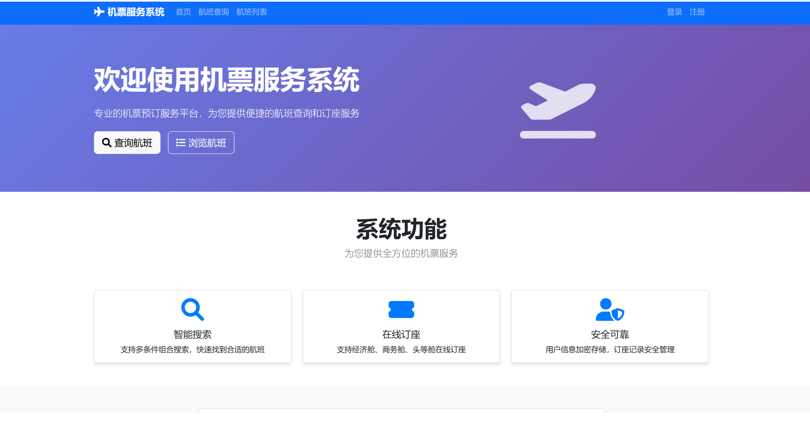
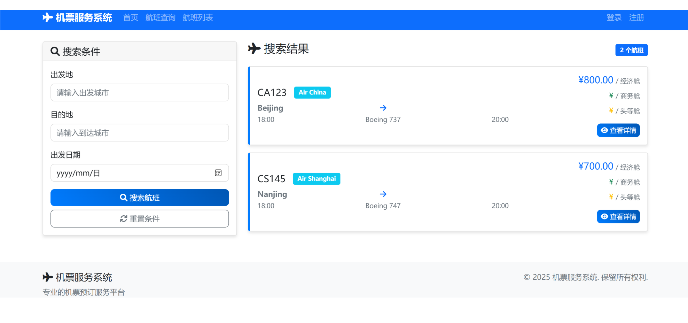
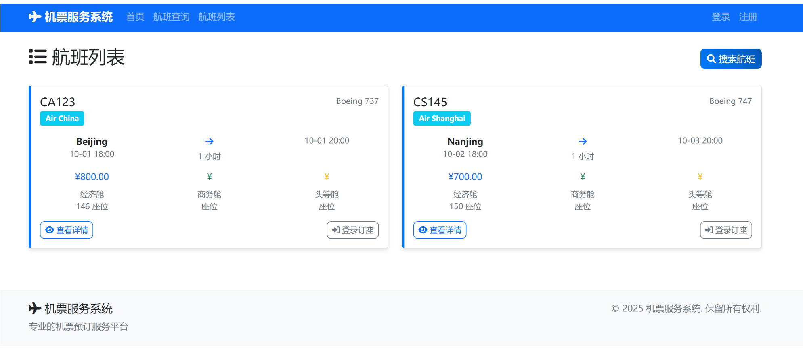

# 实验报告

## 小组分工

任务一（前端+后端）：施鸿翔、杨佳豪、周睿翔、王泽宇

任务三：刘意如

## 项目地址

[文件 - flight-ticket - Repo](https://devcloud.cn-north-4.huaweicloud.com/codehub/project/2db97c6ad2dd4c61a4a792f57dd195d0/codehub/3013491/home?ref=master)

## 前端界面展示

## Docker相关截图和接口测试截图

镜像构建成功截图：

成功运行截图：

[apifox项目地址](https://s.apifox.cn/a347396b-373b-4c2f-a202-60ba0021e516)
api调用成功：

docker-compose 快速启动

## 实验记录

无

## 实验总结

施鸿翔：项目可以vibe coding快速搭建一个框架，然后在这基础上完善

李烁：负责验证了订票管理系统的核心接口功能，包括管理员验证、查询所有订票和条件搜索订票。结果显示，各接口均能按照预期返回正确结果，管理员权限控制有效，未授权请求无法访问敏感数据;查询与搜索接口均支持JSON 格式参数，使用方便;取消订票接口能够正确释放座位并更新数据库。总体来看，系统功能完整，接口设计清晰，能够满足订票管理的基本需求。

王泽宇：对航班预订系统进行了全面完善，主要在用户管理与系统安全方面做了改进。首先，增加了用户注册、登录及资料管理 API，并通过 Token 认证机制实现访问控制，确保系统数据的安全性和私密性。其次，修复了预订中的安全漏洞，实现了用户数据隔离，避免了冒充预订等风险。在系统稳定性方面，引入事务保护与并发控制，有效防止了超卖问题。最后，结合业务需求，加入了多项规则，包括预订数量限制、航班过期检查以及 24 小时内取消限制，使系统功能更加规范与完善。
