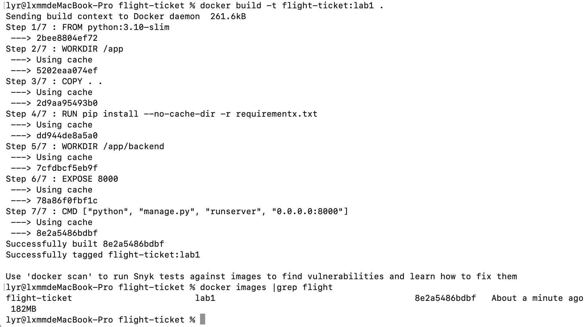
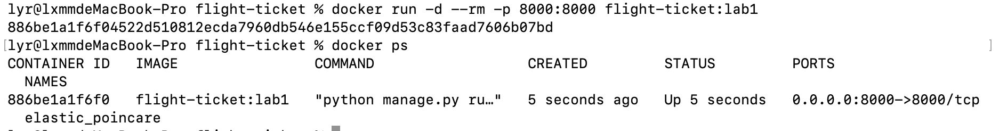
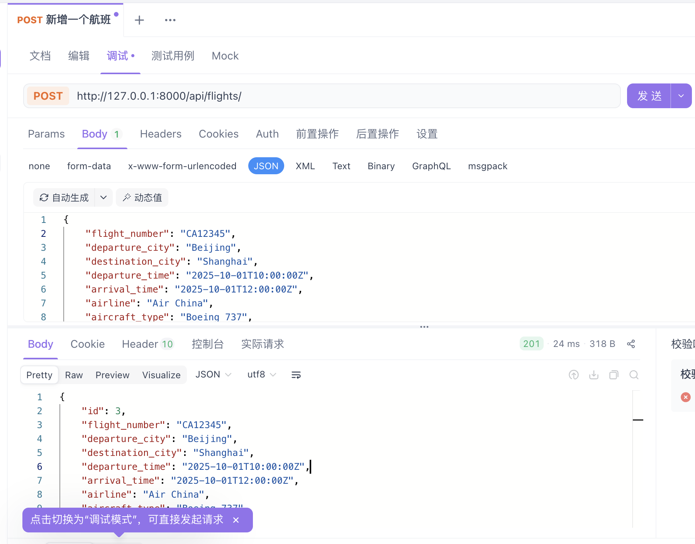
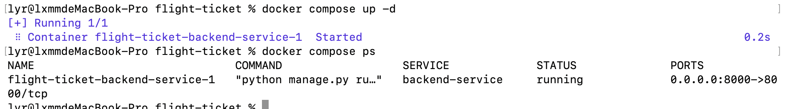

# 实验报告

## 小组分工

任务一：施鸿翔

任务三：刘意如

## 项目地址

[文件 - flight-ticket - Repo](https://devcloud.cn-north-4.huaweicloud.com/codehub/project/2db97c6ad2dd4c61a4a792f57dd195d0/codehub/3013491/home?ref=master)

## Docker相关截图和接口测试截图

镜像构建成功截图：

成功运行截图：

[apifox项目地址](https://s.apifox.cn/a347396b-373b-4c2f-a202-60ba0021e516)
api调用成功：

docker-compose 快速启动

## 实验记录

无

## 实验总结

施鸿翔：项目可以vibe coding快速搭建一个框架，然后在这基础上完善